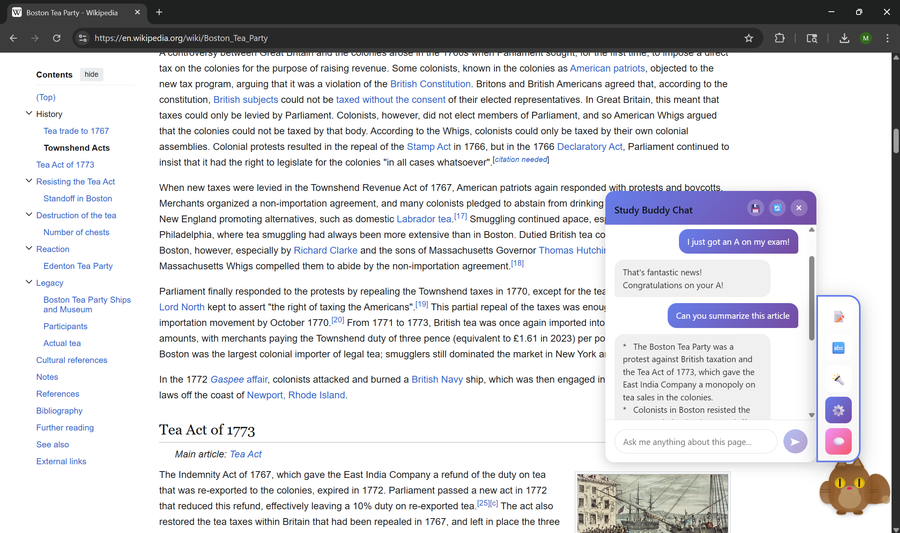
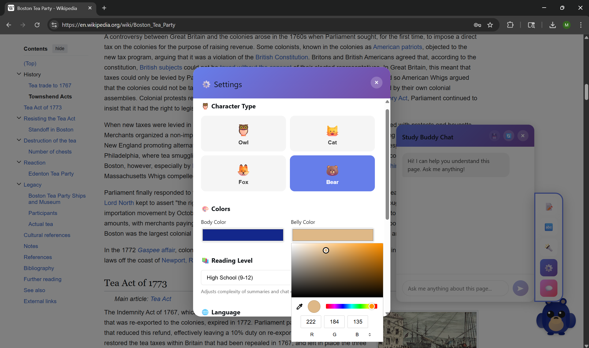
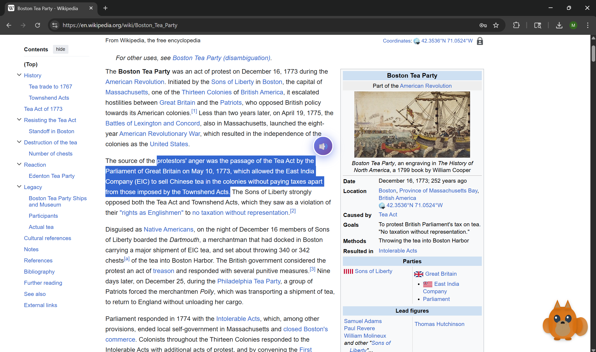

# 🦉 Study Buddy — AI Reading Companion

Reading comprehension tools are often clunky separate apps — Study Buddy lives directly on the page itself, making AI assistance feel natural rather than disruptive. Drag it anywhere, ask it anything, and never lose your place.

Built as a hackathon project.

---

## ✨ Features

### 🤖 AI-Powered
- **Summarize any page** — one click generates a concise bullet-point summary tailored to your reading level
- **Chat about the page** — ask follow-up questions and have a full conversation grounded in the page's content
- **Multi-language support** — responses in English, Spanish, or Russian
- **Reading level adjustment** — Elementary through College; the AI adapts its vocabulary and complexity accordingly

### 🔊 Accessibility
- **Text-to-speech** — highlight any text on the page and a floating button appears to read it aloud (powered by ElevenLabs with browser speech fallback)
- **Dyslexia mode** — toggles OpenDyslexic font and improved letter/line spacing across the entire page

### 🎨 Customization
- **4 characters** — Owl, Cat, Fox, or Bear
- **Custom colors** — pick body and belly color for your character
- **Draggable** — position the buddy anywhere on screen; it stays out of your way

### 💾 History
- Save full chat conversations to the cloud (AWS) and reload them from any session via the History panel

---

## 📸 Screenshots





---

## 🛠️ Tech Stack

| Layer | Technology |
|---|---|
| Extension framework | Chrome Manifest V3 |
| UI | React 18 + inline styles |
| Bundler | Webpack 5 + Babel |
| AI | Google Gemini 2.5 Flash |
| Text-to-speech | ElevenLabs API (browser Speech Synthesis fallback) |
| History storage | AWS API Gateway + Lambda + DynamoDB |

---

## 🚀 Installation (Load Unpacked)

> No Chrome Web Store listing yet — load it manually in developer mode.

1. Clone or download this repo
2. Open a terminal in the project folder and run:
   ```bash
   npm install
   npm run build
   ```
3. Open Chrome and go to `chrome://extensions`
4. Enable **Developer mode** (top right toggle)
5. Click **Load unpacked** and select the `dist/` folder
6. The 🦉 icon will appear in your extensions bar

---

## ⚙️ Setup

1. Get a free **Google Gemini API key** at [aistudio.google.com](https://aistudio.google.com/app/apikey)
2. Click the Study Buddy character on any page → open the icon bar → **Settings ⚙️**
3. Paste your key in the **Gemini API Key** field and hit **Apply Changes**

That's it — summaries and chat will now work on any page.

**Optional — ElevenLabs TTS voices:**
For higher quality read-aloud, add your [ElevenLabs API key](https://elevenlabs.io) in `src/content/tts.js`. Without it, the extension falls back to the browser's built-in speech synthesis automatically.

---

## 📁 Project Structure

```
src/
├── background/
│   └── service-worker.js     # Gemini API calls, AWS history, message routing
├── components/
│   ├── BearCharacter.jsx     # Animated bear
│   ├── CatCharacter.jsx      # Animated cat
│   ├── FoxCharacter.jsx      # Animated fox
│   ├── OwlCharacter.jsx      # Animated owl (default)
│   ├── ChatInterface.jsx     # In-page chat panel
│   ├── HistoryView.jsx       # Saved chats panel
│   └── SettingsModal.jsx     # Full settings overlay
├── content/
│   ├── StudyBuddy.jsx        # Main component — renders character + all UI
│   ├── dyslexiaMode.js       # OpenDyslexic font injection
│   ├── tts.js                # Floating TTS button on text selection
│   └── index.jsx             # Content script entry point
└── popup/
    ├── Popup.jsx             # Toolbar popup
    └── index.jsx
assets/                       # Screenshots and demo GIFs
```

---

## 🗺️ Future Work

- [ ] Additional TTS voices
- [ ] Keyboard shortcut to open/close chat
- [ ] Chrome Web Store release

---

## 📄 License

MIT
